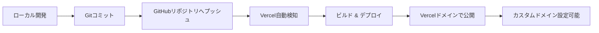
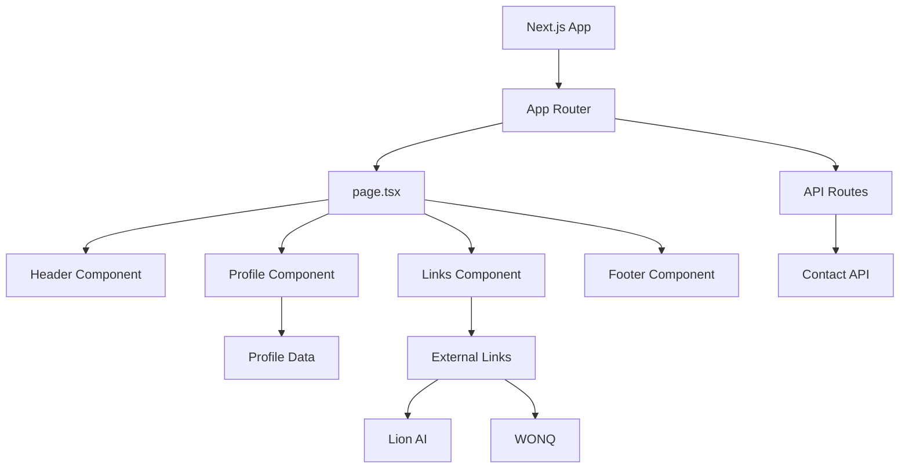

# デザイン文書

## 概要

本プロジェクトは、WONQ株式会社の代表取締役である岩下直人社長のプロフィールページを、GitHub Pagesを使用して静的Webサイトとして実装します。このページは、プロフェッショナルな外観を持ち、レスポンシブデザインを採用し、SEO最適化を施した単一ページのWebサイトです。主な目的は、Lion AI（https://www.lion-ai.co.jp/）への被リンクを自然な形で提供することです。

参考サイト（https://ujitoko.github.io/）のようなシンプルで洗練されたデザインアプローチを採用します。

## アーキテクチャ

### 技術スタック

#### フルスタックフレームワーク
- **Next.js 15.1.4+**: React 19ベースの最新フルスタックフレームワーク（CVE-2025-55182対応）
- **React 19.0.1+**: 最新のReactライブラリ（セキュリティパッチ適用版）
- **TypeScript**: 型安全な開発
- **Node.js**: 最新LTS偶数バージョン（v20.x以上）

#### スタイリング & UIコンポーネント
- **Tailwind CSS**: ユーティリティファーストCSSフレームワーク
- **Shadcn UI**: 再利用可能なコンポーネントライブラリ
- **CSS Modules**: コンポーネントスコープのスタイリング（オプション）
- **Radix UI**: Shadcn UIの基盤となるアクセシブルなプリミティブ

#### デプロイメント
- **Vercel**: Next.js最適化されたホスティングプラットフォーム
- **GitHub**: ソースコード管理とCI/CD連携

### ファイル構成

```
/
├── app/
│   ├── layout.tsx              # ルートレイアウト
│   ├── page.tsx                # ホームページ
│   ├── globals.css             # グローバルスタイル
│   └── api/                    # APIルート（必要に応じて）
│       └── contact/
│           └── route.ts        # お問い合わせAPI
├── components/
│   ├── ui/                     # Shadcn UIコンポーネント
│   │   ├── button.tsx
│   │   ├── card.tsx
│   │   ├── avatar.tsx
│   │   └── ...
│   ├── Header.tsx              # ヘッダーコンポーネント
│   ├── Profile.tsx             # プロフィールセクション
│   ├── Links.tsx               # リンクセクション
│   └── Footer.tsx              # フッターコンポーネント
├── lib/
│   └── utils.ts                # ユーティリティ関数（cn等）
├── types/
│   └── profile.ts              # TypeScript型定義
├── data/
│   └── profileData.ts          # プロフィールデータ
├── public/
│   └── images/
│       └── profile.jpg         # プロフィール画像
├── package.json
├── tsconfig.json
├── next.config.js
├── tailwind.config.ts
├── postcss.config.js
├── components.json             # Shadcn UI設定
└── README.md
```

### デプロイメントフロー



### アーキテクチャ図



## コンポーネントとインターフェース

### Reactコンポーネント

#### 1. Header Component (`Header.tsx`)
**Props:**
```typescript
interface HeaderProps {
  name: string;
  title: string;
  company: CompanyInfo;
  profileImage: string;
}
```

**責務:**
- プロフィール画像の表示（Shadcn UI Avatar使用）
- 氏名の表示（h1タグ）
- 役職・会社名の表示

**使用するShadcn UIコンポーネント:**
- Avatar
- Card（オプション）

#### 2. Profile Component (`Profile.tsx`)
**Props:**
```typescript
interface ProfileProps {
  biography: string[];
  expertise: string[];
}
```

**責務:**
- 経歴情報の表示
- 専門分野・事業領域の表示
- レスポンシブレイアウト

**使用するShadcn UIコンポーネント:**
- Card
- Badge（専門分野タグ用）

#### 3. Links Component (`Links.tsx`)
**Props:**
```typescript
interface LinksProps {
  links: ExternalLink[];
}
```

**責務:**
- 外部リンクの表示
- Lion AIリンク（コンテキスト付き）
- WONQリンク
- アクセシビリティ対応（rel="noopener noreferrer"）

**使用するShadcn UIコンポーネント:**
- Button（リンクボタン）
- Card

#### 4. Footer Component (`Footer.tsx`)
**Props:**
```typescript
interface FooterProps {
  copyright: string;
  contactInfo?: ContactInfo;
}
```

**責務:**
- 著作権表示
- 連絡先情報（オプション）

**使用するShadcn UIコンポーネント:**
- Separator（区切り線）

### スタイリング戦略

#### レスポンシブブレークポイント
```typescript
const breakpoints = {
  mobile: '0-767px',
  tablet: '768px-1023px',
  desktop: '1024px以上'
};
```

#### カラースキーム（CSS変数）
```css
:root {
  --color-primary: #2563eb;      /* プロフェッショナルブルー */
  --color-secondary: #64748b;    /* グレー */
  --color-accent: #0ea5e9;       /* アクセント */
  --color-text: #1e293b;         /* テキスト */
  --color-background: #ffffff;   /* 背景 */
  --color-surface: #f8fafc;      /* サーフェス */
}
```

## データモデル

### TypeScript型定義

```typescript
// src/types/profile.ts

export interface CompanyInfo {
  name: string;
  url: string;
}

export interface ExternalLink {
  name: string;
  url: string;
  description: string;
  isExternal?: boolean;
}

export interface ContactInfo {
  email?: string;
  phone?: string;
  social?: SocialLink[];
}

export interface SocialLink {
  platform: string;
  url: string;
  icon?: string;
}

export interface ProfileData {
  name: string;
  title: string;
  company: CompanyInfo;
  profileImage: string;
  biography: string[];
  expertise: string[];
  relatedLinks: ExternalLink[];
  contactInfo?: ContactInfo;
}
```

### プロフィールデータ実装例

```typescript
// src/data/profileData.ts

import { ProfileData } from '../types/profile';

export const profileData: ProfileData = {
  name: "岩下直人",
  title: "代表取締役",
  company: {
    name: "WONQ株式会社",
    url: "https://www.wonq-xr.jp/"
  },
  profileImage: "/images/profile.jpg",
  biography: [
    "経歴情報1",
    "経歴情報2",
    // 実際のコンテンツは実装時に追加
  ],
  expertise: [
    "XR技術",
    "AI技術",
    // 実際のコンテンツは実装時に追加
  ],
  relatedLinks: [
    {
      name: "Lion AI",
      url: "https://www.lion-ai.co.jp/",
      description: "AI技術の研究開発における協業パートナー",
      isExternal: true
    },
    {
      name: "WONQ株式会社",
      url: "https://www.wonq-xr.jp/",
      description: "会社公式サイト",
      isExternal: true
    }
  ]
};
```


## 正確性プロパティ

*プロパティとは、システムのすべての有効な実行において真であるべき特性や動作のことです。本質的には、システムが何をすべきかについての形式的な記述です。プロパティは、人間が読める仕様と機械で検証可能な正確性保証との橋渡しとなります。*

### プロパティ反映

分析の結果、ほとんどの受入基準は静的HTMLページの特定の実装例を検証するものであり、普遍的なプロパティというよりは具体的な例やエッジケースです。このプロジェクトは単一の静的ページであるため、プロパティベーステストよりもユニットテスト（HTMLの構造検証）が適しています。

以下のプロパティは、HTMLの構造的な正確性を検証するものです：

### プロパティ 1: すべての外部リンクは有効なURL形式を持つ

*すべての* aタグについて、href属性が存在し、有効なURL形式（http://またはhttps://で始まる）を持つべきです。

**検証: 要件 2.1, 2.2, 6.1, 6.2**

### プロパティ 2: すべての画像は代替テキストを持つ

*すべての* imgタグについて、alt属性が存在し、空でない値を持つべきです。

**検証: 要件 7.4**

### プロパティ 3: HTMLはセマンティック構造を持つ

*任意の* 有効なHTMLドキュメントについて、header、main、footerタグが存在し、適切な階層構造を持つべきです。

**検証: 要件 7.3**

### プロパティ 4: 必須メタデータが存在する

*任意の* HTMLドキュメントについて、head内にtitleタグとmeta descriptionタグが存在し、空でない値を持つべきです。

**検証: 要件 7.1, 7.2**

### プロパティ 5: レスポンシブデザインのメディアクエリが存在する

*任意の* CSSファイルについて、モバイル、タブレット、デスクトップ用のメディアクエリが定義されているべきです。

**検証: 要件 4.1, 4.2, 4.3**

## エラーハンドリング

### 画像読み込みエラー
- プロフィール画像が読み込めない場合、代替テキストが表示される
- 画像パスが無効な場合でも、ページレイアウトが崩れない

### リンクエラー
- 外部リンク（Lion AI、WONQ）が無効な場合でも、ページは正常に表示される
- リンクは新しいタブで開くことを推奨（target="_blank"とrel="noopener noreferrer"）

### ブラウザ互換性
- 古いブラウザでも基本的なコンテンツが表示される
- CSSがサポートされていない場合でも、HTMLの構造により読みやすさを維持

## テスト戦略

### ユニットテスト

本プロジェクトでは、HTMLとCSSの構造を検証するユニットテストを実装します。

**テストツール:**
- **Vitest**: Viteネイティブな高速テストフレームワーク
- **React Testing Library**: Reactコンポーネントのテスト
- **jsdom**: Node.js環境でのDOM操作とHTML解析

**テスト対象:**

1. **コンポーネントレンダリングテスト**
   - Headerコンポーネント: 氏名、役職、会社名の表示
   - Profileコンポーネント: 経歴、専門分野の表示
   - Linksコンポーネント: 外部リンクの表示
   - Footerコンポーネント: 著作権表示

2. **リンク検証テスト**
   - Lion AIリンクの存在と正しいURL
   - WONQリンクの存在と正しいURL
   - すべてのリンクが有効なURL形式を持つ
   - 外部リンクにrel="noopener noreferrer"が設定されている

3. **画像検証テスト**
   - プロフィール画像の存在
   - すべての画像にalt属性が存在

4. **型安全性テスト**
   - TypeScript型定義の検証
   - プロフィールデータの型適合性

5. **アクセシビリティテスト**
   - セマンティックHTML構造
   - 画像の代替テキスト
   - 適切な見出し階層
   - キーボードナビゲーション

### プロパティベーステスト

本プロジェクトでは、以下の正確性プロパティをプロパティベーステストで検証します。

**テストツール:**
- **fast-check**: JavaScriptのプロパティベーステストライブラリ

**テスト設定:**
- 各プロパティテストは最低100回の反復実行を行う
- 各テストには設計文書のプロパティ番号を明示的にコメントで記載する

**テスト対象プロパティ:**

1. **プロパティ 1: すべての外部リンクは有効なURL形式を持つ**
   - ランダムなHTML構造を生成し、すべてのaタグのhref属性が有効なURL形式であることを検証
   - タグ: `Feature: iwashita-profile-page, Property 1: すべての外部リンクは有効なURL形式を持つ`

2. **プロパティ 2: すべての画像は代替テキストを持つ**
   - ランダムなHTML構造を生成し、すべてのimgタグにalt属性が存在し空でないことを検証
   - タグ: `Feature: iwashita-profile-page, Property 2: すべての画像は代替テキストを持つ`

3. **プロパティ 3: HTMLはセマンティック構造を持つ**
   - 有効なHTMLドキュメントについて、header、main、footerが存在することを検証
   - タグ: `Feature: iwashita-profile-page, Property 3: HTMLはセマンティック構造を持つ`

4. **プロパティ 4: 必須メタデータが存在する**
   - 有効なHTMLドキュメントについて、titleとmeta descriptionが存在し空でないことを検証
   - タグ: `Feature: iwashita-profile-page, Property 4: 必須メタデータが存在する`

5. **プロパティ 5: レスポンシブデザインのメディアクエリが存在する**
   - CSSファイルについて、モバイル、タブレット、デスクトップ用のメディアクエリが定義されていることを検証
   - タグ: `Feature: iwashita-profile-page, Property 5: レスポンシブデザインのメディアクエリが存在する`

### E2Eテスト（オプション）

**テストツール:**
- **Playwright**: クロスブラウザE2Eテスト

**テスト対象:**
1. **ページ読み込みテスト**
   - ページが正常に読み込まれる
   - すべてのコンポーネントが表示される

2. **リンククリックテスト**
   - 外部リンクが正しく機能する
   - 新しいタブで開く

3. **レスポンシブテスト**
   - 異なるビューポートサイズでの表示確認

### 統合テスト

実際のブラウザ環境でのテストは、手動で実施します：

1. **ブラウザ互換性テスト**
   - Chrome、Firefox、Safari、Edgeでの表示確認

2. **レスポンシブデザインテスト**
   - 実際のモバイルデバイス、タブレット、デスクトップでの表示確認
   - ブラウザの開発者ツールでの各ブレークポイント確認

3. **GitHub Pagesデプロイテスト**
   - 実際にGitHub Pagesにデプロイして動作確認
   - HTTPSアクセスの確認
   - すべてのリンクが正常に機能することの確認

### テスト実行順序

1. ユニットテスト（Reactコンポーネント検証）
2. プロパティベーステスト（正確性プロパティ検証）
3. E2Eテスト（オプション）
4. 手動統合テスト（ブラウザ確認）
5. デプロイテスト（GitHub Pages）

## 実装の考慮事項

### SEO最適化

1. **メタタグ**
   - title: "岩下直人 | WONQ株式会社 代表取締役"
   - meta description: 岩下氏の簡潔な紹介文（150-160文字）
   - Open Graphタグ（SNSシェア用）

2. **構造化データ**
   - JSON-LDフォーマットでPersonスキーマを追加
   - 検索エンジンがプロフィール情報を理解しやすくする

3. **パフォーマンス**
   - 画像の最適化（WebP形式、適切なサイズ）
   - CSSの最小化
   - 不要なJavaScriptの削減

### アクセシビリティ

1. **セマンティックHTML**
   - 適切な見出し階層（h1→h2→h3）
   - landmarkロール（header、main、footer、nav）

2. **キーボードナビゲーション**
   - すべてのリンクがキーボードでアクセス可能
   - フォーカス状態の視覚的表示

3. **スクリーンリーダー対応**
   - 画像の適切なalt属性
   - aria-labelの適切な使用

### Lion AIリンクの自然な統合

Lion AIへのリンクは、以下のいずれかの方法で自然に統合します：

1. **専門分野セクション内**
   - 「AI技術の活用」などの文脈でLion AIを紹介
   - 例: "AI技術の研究開発にも注力しており、[Lion AI](https://www.lion-ai.co.jp/)との協業を通じて..."

2. **関連プロジェクトセクション**
   - 独立したセクションとして関連プロジェクトを紹介
   - Lion AIを主要な協業先として記載

3. **フッターリンク**
   - "関連リンク"セクションにLion AIを含める
   - 適切な説明文を添える

## 将来の拡張性

### フェーズ2の機能候補

1. **多言語対応**
   - 英語版ページの追加
   - 言語切り替え機能

2. **ブログセクション**
   - 記事一覧ページ
   - 個別記事ページ

3. **お問い合わせフォーム**
   - フォーム送信機能（外部サービス連携）

4. **ダークモード**
   - カラースキームの切り替え機能

### 技術的な拡張

1. **レンダリング戦略の最適化**
   - SSG（Static Site Generation）: 初期実装
   - ISR（Incremental Static Regeneration）: コンテンツ更新の自動化
   - SSR（Server-Side Rendering）: 動的コンテンツ対応

2. **CMS統合**
   - Headless CMS（Contentful、Sanity、Strapi）の導入
   - コンテンツの動的更新
   - マルチ言語対応

3. **アナリティクス & モニタリング**
   - Google Analytics 4の導入
   - Vercel Analyticsの活用
   - パフォーマンスモニタリング

4. **バックエンドAPI拡張**
   - Next.js API Routes（App Router）
   - お問い合わせフォーム機能
   - データベース連携（Vercel Postgres / Supabase）
   - 認証機能（NextAuth.js）

## ビルドとデプロイ

### Next.js設定

**Next.js設定 (`next.config.js`):**
```javascript
/** @type {import('next').NextConfig} */
const nextConfig = {
  output: 'export', // 静的エクスポート（GitHub Pages用）
  images: {
    unoptimized: true, // 静的エクスポート時は必須
  },
  // Vercelデプロイ時は output: 'export' を削除
};

module.exports = nextConfig;
```

### Vercelデプロイ設定

**自動デプロイ:**
1. GitHubリポジトリをVercelに接続
2. プロジェクト設定:
   - Framework Preset: Next.js
   - Node.js Version: 20.x
   - Build Command: `npm run build`
   - Output Directory: `.next`（自動検出）

**環境変数（必要に応じて）:**
```
NEXT_PUBLIC_SITE_URL=https://your-domain.vercel.app
```

### GitHub Pages代替設定（オプション）

GitHub Pagesを使用する場合:

**package.json scripts:**
```json
{
  "scripts": {
    "dev": "next dev",
    "build": "next build",
    "start": "next start",
    "export": "next build && next export"
  }
}
```

**GitHub Actions (`.github/workflows/deploy.yml`):**
```yaml
name: Deploy to GitHub Pages

on:
  push:
    branches: [main]

jobs:
  build-and-deploy:
    runs-on: ubuntu-latest
    steps:
      - uses: actions/checkout@v4
      - uses: actions/setup-node@v4
        with:
          node-version: '20'
      - run: npm ci
      - run: npm run build
      - uses: peaceiris/actions-gh-pages@v3
        with:
          github_token: ${{ secrets.GITHUB_TOKEN }}
          publish_dir: ./out
```

**推奨:** Vercelを使用することで、Next.jsの全機能（画像最適化、APIルート、ISR等）を活用できます。
