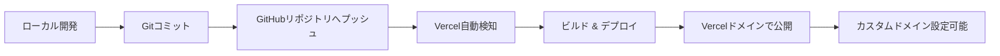

# デザイン文書

## 概要

本プロジェクトは、WONQ 株式会社のシステムエンジニア(SE)であるalbeeの複数のプロフィールページを、GitHub Pages を使用して静的 Web サイトとして実装します。このサイトは、用途別に最適化された以下の2つのページを提供します：

1. **趣味・個人開発用プロフィールページ** (`/hobby` パス) - 個人開発プロジェクト、技術的興味、趣味に焦点
2. **転職活動用プロフィールページ** (`/career` パス) - 職歴、業務経験、転職関連スキルに焦点

各ページは、プロフェッショナルな外観を持ち、レスポンシブデザインを採用し、SEO 最適化を施した構成となります。主な目的は、それぞれの用途に適した被リンクを自然な形で提供することです。

参考サイト（https://ujitoko.github.io/）のようなシンプルで洗練されたデザインアプローチを採用し、ページ間のナビゲーションを提供します。

## アーキテクチャ

### 技術スタック

#### フルスタックフレームワーク

- **Next.js 15.1.4+**: React 19 ベースの最新フルスタックフレームワーク（CVE-2025-55182 対応）
- **React 19.0.1+**: 最新の React ライブラリ（セキュリティパッチ適用版）
- **TypeScript**: 型安全な開発
- **Node.js**: 最新 LTS 偶数バージョン（v20.x 以上）

#### スタイリング & UI コンポーネント

- **Tailwind CSS**: ユーティリティファースト CSS フレームワーク
- **Shadcn UI**: 再利用可能なコンポーネントライブラリ
- **CSS Modules**: コンポーネントスコープのスタイリング（オプション）
- **Radix UI**: Shadcn UI の基盤となるアクセシブルなプリミティブ

#### デプロイメント

- **Vercel**: Next.js 最適化されたホスティングプラットフォーム
- **GitHub**: ソースコード管理と CI/CD 連携

### ファイル構成

```
/
├── app/
│   ├── layout.tsx              # ルートレイアウト
│   ├── page.tsx                # ホームページ（ページ選択またはデフォルト）
│   ├── globals.css             # グローバルスタイル
│   ├── hobby/
│   │   └── page.tsx            # 趣味・個人開発用プロフィールページ
│   ├── career/
│   │   └── page.tsx            # 転職活動用プロフィールページ
│   └── api/                    # APIルート（必要に応じて）
│       └── contact/
│           └── route.ts        # お問い合わせAPI
├── components/
│   ├── ui/                     # Shadcn UIコンポーネント
│   │   ├── button.tsx
│   │   ├── card.tsx
│   │   ├── avatar.tsx
│   │   └── ...
│   ├── Header.tsx              # ヘッダーコンポーネント
│   ├── Profile.tsx             # プロフィールセクション
│   ├── Links.tsx               # リンクセクション
│   ├── Navigation.tsx          # ページ間ナビゲーション
│   ├── PageSelector.tsx        # ページ選択コンポーネント
│   └── Footer.tsx              # フッターコンポーネント
├── lib/
│   └── utils.ts                # ユーティリティ関数（cn等）
├── types/
│   └── profile.ts              # TypeScript型定義
├── data/
│   ├── hobbyProfileData.ts     # 趣味用プロフィールデータ
│   ├── careerProfileData.ts    # 転職活動用プロフィールデータ
│   └── commonData.ts           # 共通データ
├── public/
│   └── images/
│       └── albee_icon.png         # プロフィール画像
├── package.json
├── tsconfig.json
├── next.config.js
├── tailwind.config.ts
├── postcss.config.js
├── components.json             # Shadcn UI設定
└── README.md
```

### デプロイメントフロー



### アーキテクチャ図

```mermaid
graph TD
    A[Next.js App] --> B[App Router]
    B --> C[Root page.tsx - Page Selector]
    B --> D[/hobby/page.tsx]
    B --> E[/career/page.tsx]

    D --> F[Header Component]
    D --> G[Profile Component - Hobby]
    D --> H[Links Component - Hobby]
    D --> I[Navigation Component]
    D --> J[Footer Component]

    E --> K[Header Component]
    E --> L[Profile Component - Career]
    E --> M[Links Component - Career]
    E --> N[Navigation Component]
    E --> O[Footer Component]

    G --> P[Hobby Profile Data]
    L --> Q[Career Profile Data]
    H --> R[Hobby External Links]
    M --> S[Career External Links]

    R --> T[YouTube]
    R --> U[Blogger]
    S --> V[LinkedIn]
    S --> W[GitHub]
```

## コンポーネントとインターフェース

### React コンポーネント

#### 1. Header Component (`Header.tsx`)

**Props:**

```typescript
interface HeaderProps {
  name: string;
  title: string;
  company?: CompanyInfo;
  profileImage: string;
  pageType: "hobby" | "career";
}
```

**責務:**

- プロフィール画像の表示（Shadcn UI Avatar 使用）
- 氏名の表示（h1 タグ）
- ページタイプに応じた役職・会社名の表示

**使用する Shadcn UI コンポーネント:**

- Avatar
- Card（オプション）

#### 2. Profile Component (`Profile.tsx`)

**Props:**

```typescript
interface ProfileProps {
  biography: string[];
  expertise: string[];
  pageType: "hobby" | "career";
  projects?: ProjectInfo[];
  experience?: WorkExperience[];
}
```

**責務:**

- ページタイプに応じた情報の表示
- 趣味用：個人開発プロジェクト、技術的興味、趣味
- 転職活動用：職歴、業務経験、転職関連スキル
- レスポンシブレイアウト

**使用する Shadcn UI コンポーネント:**

- Card
- Badge（専門分野タグ用）

#### 3. Links Component (`Links.tsx`)

**Props:**

```typescript
interface LinksProps {
  links: ExternalLink[];
  pageType: "hobby" | "career";
}
```

**責務:**

- ページタイプに応じた外部リンクの表示
- 趣味用：YouTube、Blogger、GitHub リンク
- 転職活動用：GitHub リンクポートフォリオ等
- アクセシビリティ対応（rel="noopener noreferrer"）

**使用する Shadcn UI コンポーネント:**

- Button（リンクボタン）
- Card

#### 4. Navigation Component (`Navigation.tsx`)

**Props:**

```typescript
interface NavigationProps {
  currentPage: "hobby" | "career";
}
```

**責務:**

- ページ間のナビゲーション
- 現在のページの表示
- 他のページへのリンク

**使用する Shadcn UI コンポーネント:**

- Button
- Badge（現在ページ表示用）

#### 5. PageSelector Component (`PageSelector.tsx`)

**Props:**

```typescript
interface PageSelectorProps {
  onPageSelect?: (page: "hobby" | "career") => void;
}
```

**責務:**

- ルートページでのページ選択UI
- 各ページの説明表示
- ページへの誘導

**使用する Shadcn UI コンポーネント:**

- Card
- Button

#### 6. Footer Component (`Footer.tsx`)

**Props:**

```typescript
interface FooterProps {
  copyright: string;
  contactInfo?: ContactInfo;
  pageType?: "hobby" | "career";
}
```

**責務:**

- 著作権表示
- 連絡先情報（オプション）
- ページタイプに応じた追加情報

**使用する Shadcn UI コンポーネント:**

- Separator（区切り線）

### スタイリング戦略

#### レスポンシブブレークポイント

```typescript
const breakpoints = {
  mobile: "0-767px",
  tablet: "768px-1023px",
  desktop: "1024px以上",
};
```

#### カラースキーム（CSS 変数）

```css
:root {
  --color-primary: #2563eb; /* プロフェッショナルブルー */
  --color-secondary: #64748b; /* グレー */
  --color-accent: #0ea5e9; /* アクセント */
  --color-text: #1e293b; /* テキスト */
  --color-background: #ffffff; /* 背景 */
  --color-surface: #f8fafc; /* サーフェス */
}
```

## データモデル

### TypeScript 型定義

```typescript
// src/types/profile.ts

export interface CompanyInfo {
  name: string;
  url: string;
}

export interface ExternalLink {
  name: string;
  url: string;
  description: string;
  isExternal?: boolean;
  category?: "social" | "work" | "hobby" | "portfolio";
}

export interface ProjectInfo {
  name: string;
  description: string;
  technologies: string[];
  url?: string;
  status: "active" | "completed" | "archived";
}

export interface WorkExperience {
  company: string;
  position: string;
  period: string;
  description: string[];
  technologies?: string[];
}

export interface ContactInfo {
  email?: string;
  phone?: string;
  social?: SocialLink[];
}

export interface SocialLink {
  platform: string;
  url: string;
  icon?: string;
}

export interface ProfileData {
  name: string;
  title: string;
  company?: CompanyInfo;
  profileImage: string;
  biography: string[];
  expertise: string[];
  relatedLinks: ExternalLink[];
  contactInfo?: ContactInfo;
  pageType: "hobby" | "career";
  projects?: ProjectInfo[];
  experience?: WorkExperience[];
}

export interface PageConfig {
  title: string;
  description: string;
  keywords: string[];
  ogImage?: string;
}
```

### プロフィールデータ実装例

```typescript
// src/data/hobbyProfileData.ts

import { ProfileData } from "../types/profile";

export const hobbyProfileData: ProfileData = {
  name: "albee",
  title: "個人開発者・技術愛好家",
  profileImage: "/images/albee_icon.png",
  pageType: "hobby",
  biography: [
    "技術への情熱を持つ個人開発者として、様々なプロジェクトに取り組んでいます。",
    "AI技術、ゲーム開発、Web技術など幅広い分野に興味を持ち、継続的に学習を続けています。",
    "現在はフロントエンドについて学習中です。",
  ],
  expertise: [
    "個人開発",
    "AI",
    "フルスタック",
    "バックエンド",
    "フロントエンド",
    "C#",
    "TypeScript",
    "Kiro",
    "Antigravity",
    "SDD",
  ],
  projects: [
    {
      name: "個人開発用ブログ",
      description: "技術と個人開発について発信するBloggerブログ",
      technologies: ["Blogger", "JavaScript", "HTML/CSS"],
      url: "https://linealbeegames4730.blogspot.com/",
      status: "active",
    },
    {
      name: "技術解説YouTube",
      description: "プログラミングとAI技術の解説動画",
      technologies: ["動画編集", "プレゼンテーション"],
      url: "https://www.YouTube.com/@albeegamengine",
      status: "active",
    },
  ],
  relatedLinks: [
    {
      name: "個人開発用ブログ",
      url: "https://linealbeegames4730.blogspot.com/",
      description: "個人開発用ブログ(Blogger)のリンクです。",
      isExternal: true,
      category: "hobby",
    },
    {
      name: "YouTube",
      url: "https://www.YouTube.com/@albeegamengine",
      description: "個人開発用YouTubeのリンクです。",
      isExternal: true,
      category: "hobby",
    },
    {
      name: "GitHub",
      url: "https://github.com/albeegamengine",
      description: "個人開発用のGitHubのリンクです。",
      isExternal: true,
      category: "hobby",
    },
  ],
};

// src/data/careerProfileData.ts

export const careerProfileData: ProfileData = {
  name: "albee",
  title: "システムエンジニア",
  company: {
    name: "WONQ 株式会社",
    url: "https://wonq.co.jp", // 実際のURLに要変更
  },
  profileImage: "/images/albee_icon.png",
  pageType: "career",
  biography: [
    "WONQ株式会社 システムエンジニア。",
    "九州大学大学院総合理工学府修了。",
    "2024年12月にWONQ株式会社に入社。",
    "入社後建築企業向け業務システムや塗装企業向けの基幹システムの構築など主にバックエンド側のシステム開発に従事。",
    "現在はフロントエンドについて学習中。",
  ],
  expertise: [
    "フルスタック",
    "バックエンド",
    "フロントエンド",
    "AI",
    "C#",
    "TypeScript",
    "システム設計",
    "データベース設計",
    "API開発",
  ],
  experience: [
    {
      company: "WONQ 株式会社",
      position: "システムエンジニア",
      period: "2024年12月 - 現在",
      description: [
        "建築企業向け業務システムの構築",
        "塗装企業向けの基幹システムの構築",
        "主にバックエンド側のシステム開発に従事",
        "フロントエンド技術の学習・適用",
      ],
      technologies: ["C#", "TypeScript", "データベース設計", "API開発"],
    },
  ],
  relatedLinks: [
    {
      name: "GitHub",
      url: "https://github.com/albeegamengine",
      description: "技術的なプロジェクトとコード",
      isExternal: true,
      category: "portfolio",
    },
  ],
};

// src/data/commonData.ts

export const commonData = {
  name: "albee",
  profileImage: "/images/albee_icon.png",
  favicon: "/images/albee_icon.png",
  copyright: "© 2024 albee. All rights reserved.",
  contactInfo: {
    email: "contact@example.com", // 実際のメールアドレスに要変更
  },
};
```

## 正確性プロパティ

_プロパティとは、システムのすべての有効な実行において真であるべき特性や動作のことです。本質的には、システムが何をすべきかについての形式的な記述です。プロパティは、人間が読める仕様と機械で検証可能な正確性保証との橋渡しとなります。_

### プロパティ反映

分析の結果、複数ページ対応により新しいプロパティが追加され、既存のプロパティも更新されました。以下のプロパティは、両方のプロフィールページ（趣味用・転職活動用）に適用される普遍的なルールです。

### プロパティ 1: すべてのプロフィールページは基本情報を表示する

_すべての_ プロフィールページについて、氏名とプロフィール画像が表示されるべきです。

**検証: 要件 1.3, 1.4**

### プロパティ 2: すべての外部リンクは正しく機能する

_すべての_ 外部リンクについて、有効なURL形式を持ち、HTMLアンカータグとして存在し、適切な説明文を含むべきです。

**検証: 要件 2.4, 2.5, 2.6**

### プロパティ 3: すべてのページはレスポンシブデザインを持つ

_すべての_ プロフィールページについて、モバイル、タブレット、デスクトップの各画面サイズで適切にレイアウトが調整され、すべてのコンテンツが表示されるべきです。

**検証: 要件 4.1, 4.2, 4.3, 4.4**

### プロパティ 4: すべてのページは統一されたデザインを持つ

_すべての_ プロフィールページについて、統一されたカラースキーム、読みやすいタイポグラフィ、適切な余白とスペーシングを持つべきです。

**検証: 要件 5.1, 5.2, 5.3**

### プロパティ 5: すべてのページはナビゲーション機能を持つ

_すべての_ プロフィールページについて、他のプロフィールページへのナビゲーションリンクを含み、各リンクが何のページかを明示するべきです。

**検証: 要件 6.1, 6.4**

### プロパティ 6: すべてのページは適切なHTML構造とメタデータを持つ

_すべての_ プロフィールページについて、適切なtitleタグ、meta descriptionタグ、セマンティックHTMLタグ（header、main、footer等）を含み、すべての画像に適切なalt属性が設定されているべきです。

**検証: 要件 7.1, 7.2, 7.3, 7.4**

## エラーハンドリング

### 画像読み込みエラー

- プロフィール画像が読み込めない場合、代替テキストが表示される
- 画像パスが無効な場合でも、ページレイアウトが崩れない

### リンクエラー

- 外部リンク（YouTube、WONQ）が無効な場合でも、ページは正常に表示される
- リンクは新しいタブで開くことを推奨（target="\_blank"と rel="noopener noreferrer"）

### ブラウザ互換性

- 古いブラウザでも基本的なコンテンツが表示される
- CSS がサポートされていない場合でも、HTML の構造により読みやすさを維持

## テスト戦略

### ユニットテスト

本プロジェクトでは、複数ページの HTML と CSS の構造を検証するユニットテストを実装します。

**テストツール:**

- **Vitest**: Vite ネイティブな高速テストフレームワーク
- **React Testing Library**: React コンポーネントのテスト
- **jsdom**: Node.js 環境での DOM 操作と HTML 解析

**テスト対象:**

1. **コンポーネントレンダリングテスト**
   - Header コンポーネント: ページタイプに応じた氏名、役職、会社名の表示
   - Profile コンポーネント: ページタイプに応じた経歴、専門分野の表示
   - Links コンポーネント: ページタイプに応じた外部リンクの表示
   - Navigation コンポーネント: ページ間ナビゲーションの表示
   - PageSelector コンポーネント: ルートページでのページ選択UI
   - Footer コンポーネント: 著作権表示

2. **ページ固有テスト**
   - Hobby Profile Page: 個人開発・趣味関連コンテンツの表示
   - Career Profile Page: 転職活動・職歴関連コンテンツの表示
   - Root Page: ページ選択機能の表示

3. **リンク検証テスト**
   - Hobby Page: YouTube、Blogger リンクの存在と正しい URL
   - Career Page: LinkedIn、GitHub リンクの存在と正しい URL
   - すべてのリンクが有効な URL 形式を持つ
   - 外部リンクに rel="noopener noreferrer"が設定されている
   - ナビゲーションリンクの正しい動作

4. **画像検証テスト**
   - プロフィール画像の存在
   - すべての画像に alt 属性が存在

5. **型安全性テスト**
   - TypeScript 型定義の検証
   - 複数のプロフィールデータの型適合性

6. **アクセシビリティテスト**
   - セマンティック HTML 構造
   - 画像の代替テキスト
   - 適切な見出し階層
   - キーボードナビゲーション

### プロパティベーステスト

本プロジェクトでは、以下の正確性プロパティをプロパティベーステストで検証します。

**テストツール:**

- **fast-check**: JavaScript のプロパティベーステストライブラリ

**テスト設定:**

- 各プロパティテストは最低 100 回の反復実行を行う
- 各テストには設計文書のプロパティ番号を明示的にコメントで記載する

**テスト対象プロパティ:**

1. **プロパティ 1: すべてのプロフィールページは基本情報を表示する**
   - ランダムなページタイプ（hobby/career）を生成し、すべてのページで氏名とプロフィール画像が表示されることを検証
   - タグ: `Feature: my-profile-page, Property 1: すべてのプロフィールページは基本情報を表示する`

2. **プロパティ 2: すべての外部リンクは正しく機能する**
   - ランダムなリンクデータを生成し、すべてのリンクが有効なURL形式、HTMLアンカータグ、適切な説明文を持つことを検証
   - タグ: `Feature: my-profile-page, Property 2: すべての外部リンクは正しく機能する`

3. **プロパティ 3: すべてのページはレスポンシブデザインを持つ**
   - ランダムな画面サイズを生成し、すべてのページで適切なレイアウト調整が行われることを検証
   - タグ: `Feature: my-profile-page, Property 3: すべてのページはレスポンシブデザインを持つ`

4. **プロパティ 4: すべてのページは統一されたデザインを持つ**
   - ランダムなページを生成し、統一されたカラースキーム、タイポグラフィ、余白が適用されることを検証
   - タグ: `Feature: my-profile-page, Property 4: すべてのページは統一されたデザインを持つ`

5. **プロパティ 5: すべてのページはナビゲーション機能を持つ**
   - ランダムなページを生成し、ナビゲーションリンクが存在し、適切な説明を持つことを検証
   - タグ: `Feature: my-profile-page, Property 5: すべてのページはナビゲーション機能を持つ`

6. **プロパティ 6: すべてのページは適切なHTML構造とメタデータを持つ**
   - ランダムなページを生成し、適切なメタデータ、セマンティックHTML、画像のalt属性が存在することを検証
   - タグ: `Feature: my-profile-page, Property 6: すべてのページは適切なHTML構造とメタデータを持つ`

### E2E テスト（オプション）

**テストツール:**

- **Playwright**: クロスブラウザ E2E テスト

**テスト対象:**

1. **ページ読み込みテスト**
   - ページが正常に読み込まれる
   - すべてのコンポーネントが表示される

2. **リンククリックテスト**
   - 外部リンクが正しく機能する
   - 新しいタブで開く

3. **レスポンシブテスト**
   - 異なるビューポートサイズでの表示確認

### 統合テスト

実際のブラウザ環境でのテストは、手動で実施します：

1. **ブラウザ互換性テスト**
   - Chrome、Firefox、Safari、Edge での表示確認

2. **レスポンシブデザインテスト**
   - 実際のモバイルデバイス、タブレット、デスクトップでの表示確認
   - ブラウザの開発者ツールでの各ブレークポイント確認

3. **GitHub Pages デプロイテスト**
   - 実際に GitHub Pages にデプロイして動作確認
   - HTTPS アクセスの確認
   - すべてのリンクが正常に機能することの確認

### テスト実行順序

1. ユニットテスト（React コンポーネント検証）
2. プロパティベーステスト（正確性プロパティ検証）
3. E2E テスト（オプション）
4. 手動統合テスト（ブラウザ確認）
5. デプロイテスト（GitHub Pages）

## 実装の考慮事項

### SEO 最適化

1. **メタタグ**
   - title: "albee"
   - meta description: albeeの簡潔な紹介文（150-160 文字）
   - Open Graph タグ（SNS シェア用）
   - favicon: `/images/albee_icon.png`

2. **構造化データ**
   - JSON-LD フォーマットで Person スキーマを追加
   - 検索エンジンがプロフィール情報を理解しやすくする

3. **パフォーマンス**
   - 画像の最適化（WebP 形式、適切なサイズ）
   - CSS の最小化
   - 不要な JavaScript の削減

### アクセシビリティ

1. **セマンティック HTML**
   - 適切な見出し階層（h1→h2→h3）
   - landmark ロール（header、main、footer、nav）

2. **キーボードナビゲーション**
   - すべてのリンクがキーボードでアクセス可能
   - フォーカス状態の視覚的表示

3. **スクリーンリーダー対応**
   - 画像の適切な alt 属性
   - aria-label の適切な使用

### YouTube リンクの自然な統合

YouTube へのリンクは、以下のいずれかの方法で自然に統合します：

1. **専門分野セクション内**
   - 「AI 技術の活用」などの文脈で YouTube を紹介
   - 例: "AI 技術の研究開発にも注力しており、[YouTube](hhttps://www.YouTube.com/@albeegamengine)との協業を通じて..."

2. **関連プロジェクトセクション**
   - 独立したセクションとして関連プロジェクトを紹介
   - YouTube を主要な協業先として記載

3. **フッターリンク**
   - "関連リンク"セクションに YouTube を含める
   - 適切な説明文を添える

## 将来の拡張性

### フェーズ 2 の機能候補

1. **多言語対応**
   - 英語版ページの追加
   - 言語切り替え機能

2. **ブログセクション**
   - 記事一覧ページ
   - 個別記事ページ

3. **お問い合わせフォーム**
   - フォーム送信機能（外部サービス連携）

4. **ダークモード**
   - カラースキームの切り替え機能

### 技術的な拡張

1. **レンダリング戦略の最適化**
   - SSG（Static Site Generation）: 初期実装
   - ISR（Incremental Static Regeneration）: コンテンツ更新の自動化
   - SSR（Server-Side Rendering）: 動的コンテンツ対応

2. **CMS 統合**
   - Headless CMS（Contentful、Sanity、Strapi）の導入
   - コンテンツの動的更新
   - マルチ言語対応

3. **アナリティクス & モニタリング**
   - Google Analytics 4 の導入
   - Vercel Analytics の活用
   - パフォーマンスモニタリング

4. **バックエンド API 拡張**
   - Next.js API Routes（App Router）
   - お問い合わせフォーム機能
   - データベース連携（Vercel Postgres / Supabase）
   - 認証機能（NextAuth.js）

## ビルドとデプロイ

### Next.js 設定

**Next.js 設定 (`next.config.js`):**

```javascript
/** @type {import('next').NextConfig} */
const nextConfig = {
  output: "export", // 静的エクスポート（GitHub Pages用）
  images: {
    unoptimized: true, // 静的エクスポート時は必須
  },
  // Vercelデプロイ時は output: 'export' を削除
};

module.exports = nextConfig;
```

### Vercel デプロイ設定

**自動デプロイ:**

1. GitHub リポジトリを Vercel に接続
2. プロジェクト設定:
   - Framework Preset: Next.js
   - Node.js Version: 20.x
   - Build Command: `npm run build`
   - Output Directory: `.next`（自動検出）

**環境変数（必要に応じて）:**

```
NEXT_PUBLIC_SITE_URL=https://your-domain.vercel.app
```

### GitHub Pages 代替設定（オプション）

GitHub Pages を使用する場合:

**package.json scripts:**

```json
{
  "scripts": {
    "dev": "next dev",
    "build": "next build",
    "start": "next start",
    "export": "next build && next export"
  }
}
```

**GitHub Actions (`.github/workflows/deploy.yml`):**

```yaml
name: Deploy to GitHub Pages

on:
  push:
    branches: [main]

jobs:
  build-and-deploy:
    runs-on: ubuntu-latest
    steps:
      - uses: actions/checkout@v4
      - uses: actions/setup-node@v4
        with:
          node-version: "20"
      - run: npm ci
      - run: npm run build
      - uses: peaceiris/actions-gh-pages@v3
        with:
          github_token: ${{ secrets.GITHUB_TOKEN }}
          publish_dir: ./out
```

**推奨:** Vercel を使用することで、Next.js の全機能（画像最適化、API ルート、ISR 等）を活用できます。
