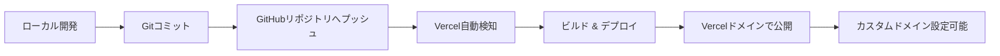
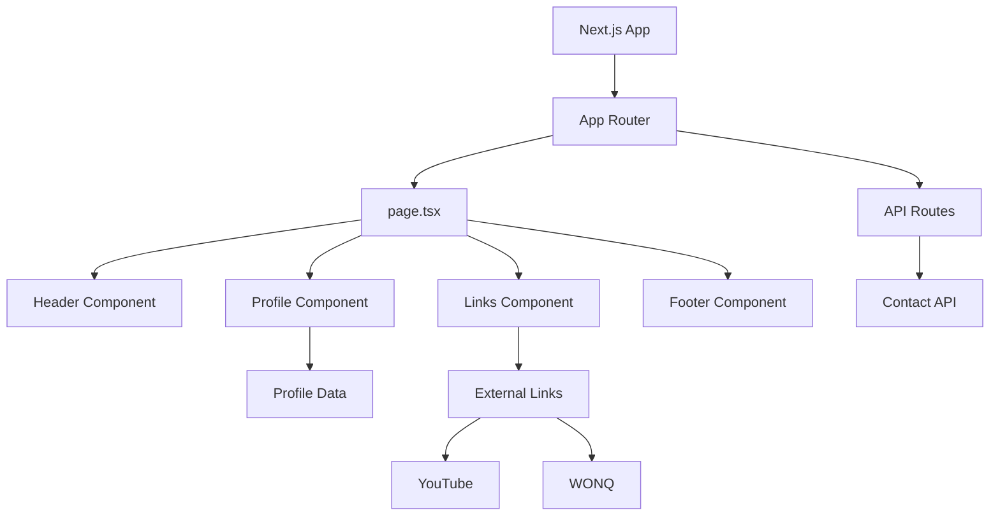

# デザイン文書

## 概要

本プロジェクトは、WONQ 株式会社のシステムエンジニア(SE)である麻生真介のプロフィールページを、GitHub Pages を使用して静的 Web サイトとして実装します。このページは、プロフェッショナルな外観を持ち、レスポンシブデザインを採用し、SEO 最適化を施した単一ページの Web サイトです。主な目的は、Blogger（linealbeegames4730.blogspot.com / https://www.YouTube.com/@albeegamengine）への被リンクを自然な形で提供することです。

参考サイト（https://ujitoko.github.io/）のようなシンプルで洗練されたデザインアプローチを採用します。

## アーキテクチャ

### 技術スタック

#### フルスタックフレームワーク

- **Next.js 15.1.4+**: React 19 ベースの最新フルスタックフレームワーク（CVE-2025-55182 対応）
- **React 19.0.1+**: 最新の React ライブラリ（セキュリティパッチ適用版）
- **TypeScript**: 型安全な開発
- **Node.js**: 最新 LTS 偶数バージョン（v20.x 以上）

#### スタイリング & UI コンポーネント

- **Tailwind CSS**: ユーティリティファースト CSS フレームワーク
- **Shadcn UI**: 再利用可能なコンポーネントライブラリ
- **CSS Modules**: コンポーネントスコープのスタイリング（オプション）
- **Radix UI**: Shadcn UI の基盤となるアクセシブルなプリミティブ

#### デプロイメント

- **Vercel**: Next.js 最適化されたホスティングプラットフォーム
- **GitHub**: ソースコード管理と CI/CD 連携

### ファイル構成

```
/
├── app/
│   ├── layout.tsx              # ルートレイアウト
│   ├── page.tsx                # ホームページ
│   ├── globals.css             # グローバルスタイル
│   └── api/                    # APIルート（必要に応じて）
│       └── contact/
│           └── route.ts        # お問い合わせAPI
├── components/
│   ├── ui/                     # Shadcn UIコンポーネント
│   │   ├── button.tsx
│   │   ├── card.tsx
│   │   ├── avatar.tsx
│   │   └── ...
│   ├── Header.tsx              # ヘッダーコンポーネント
│   ├── Profile.tsx             # プロフィールセクション
│   ├── Links.tsx               # リンクセクション
│   └── Footer.tsx              # フッターコンポーネント
├── lib/
│   └── utils.ts                # ユーティリティ関数（cn等）
├── types/
│   └── profile.ts              # TypeScript型定義
├── data/
│   └── profileData.ts          # プロフィールデータ
├── public/
│   └── images/
│       └── albee_icon.png         # プロフィール画像
├── package.json
├── tsconfig.json
├── next.config.js
├── tailwind.config.ts
├── postcss.config.js
├── components.json             # Shadcn UI設定
└── README.md
```

### デプロイメントフロー



### アーキテクチャ図



## コンポーネントとインターフェース

### React コンポーネント

#### 1. Header Component (`Header.tsx`)

**Props:**

```typescript
interface HeaderProps {
  name: string;
  title: string;
  company: CompanyInfo;
  profileImage: string;
}
```

**責務:**

- プロフィール画像の表示（Shadcn UI Avatar 使用）
- 氏名の表示（h1 タグ）
- 役職・会社名の表示

**使用する Shadcn UI コンポーネント:**

- Avatar
- Card（オプション）

#### 2. Profile Component (`Profile.tsx`)

**Props:**

```typescript
interface ProfileProps {
  biography: string[];
  expertise: string[];
}
```

**責務:**

- 経歴情報の表示
- 専門分野・事業領域の表示
- レスポンシブレイアウト

**使用する Shadcn UI コンポーネント:**

- Card
- Badge（専門分野タグ用）

#### 3. Links Component (`Links.tsx`)

**Props:**

```typescript
interface LinksProps {
  links: ExternalLink[];
}
```

**責務:**

- 外部リンクの表示
- YouTube リンク（コンテキスト付き）
- WONQ リンク
- アクセシビリティ対応（rel="noopener noreferrer"）

**使用する Shadcn UI コンポーネント:**

- Button（リンクボタン）
- Card

#### 4. Footer Component (`Footer.tsx`)

**Props:**

```typescript
interface FooterProps {
  copyright: string;
  contactInfo?: ContactInfo;
}
```

**責務:**

- 著作権表示
- 連絡先情報（オプション）

**使用する Shadcn UI コンポーネント:**

- Separator（区切り線）

### スタイリング戦略

#### レスポンシブブレークポイント

```typescript
const breakpoints = {
  mobile: "0-767px",
  tablet: "768px-1023px",
  desktop: "1024px以上",
};
```

#### カラースキーム（CSS 変数）

```css
:root {
  --color-primary: #2563eb; /* プロフェッショナルブルー */
  --color-secondary: #64748b; /* グレー */
  --color-accent: #0ea5e9; /* アクセント */
  --color-text: #1e293b; /* テキスト */
  --color-background: #ffffff; /* 背景 */
  --color-surface: #f8fafc; /* サーフェス */
}
```

## データモデル

### TypeScript 型定義

```typescript
// src/types/profile.ts

export interface CompanyInfo {
  name: string;
  url: string;
}

export interface ExternalLink {
  name: string;
  url: string;
  description: string;
  isExternal?: boolean;
}

export interface ContactInfo {
  email?: string;
  phone?: string;
  social?: SocialLink[];
}

export interface SocialLink {
  platform: string;
  url: string;
  icon?: string;
}

export interface ProfileData {
  name: string;
  title: string;
  company: CompanyInfo;
  profileImage: string;
  biography: string[];
  expertise: string[];
  relatedLinks: ExternalLink[];
  contactInfo?: ContactInfo;
}
```

### プロフィールデータ実装例

```typescript
// src/data/profileData.ts

import { ProfileData } from "../types/profile";

export const profileData: ProfileData = {
  name: "麻生真介",
  title: "システムエンジニア(SE)",
  blog: {
    name: "ブログ(個人開発)",
    url: "https://linealbeegames4730.blogspot.com/",
  },
  profileImage: "/images/albee_icon.png",
  biography: [
    "経歴情報1",
    "経歴情報2",
    // 実際のコンテンツは実装時に追加
  ],
  expertise: [
    "バックエンド",
    "フロントエンド",
    "AI",
    "X(旧Twitter)"
    "Blogger",
    "YouTube"
    // 実際のコンテンツは実装時に追加
  ],
  relatedLinks: [
    {
      name: "Blogger",
      url: "https://linealbeegames4730.blogspot.com/",
      description: "個人開発用ブログ",
      isExternal: true,
    },
    {
      name: "YouTube",
      url: "https://www.YouTube.com/@albeegamengine",
      description: "YouTubeリンク",
      isExternal: true,
    },
  ],
};
```

## 正確性プロパティ

_プロパティとは、システムのすべての有効な実行において真であるべき特性や動作のことです。本質的には、システムが何をすべきかについての形式的な記述です。プロパティは、人間が読める仕様と機械で検証可能な正確性保証との橋渡しとなります。_

### プロパティ反映

分析の結果、ほとんどの受入基準は静的 HTML ページの特定の実装例を検証するものであり、普遍的なプロパティというよりは具体的な例やエッジケースです。このプロジェクトは単一の静的ページであるため、プロパティベーステストよりもユニットテスト（HTML の構造検証）が適しています。

以下のプロパティは、HTML の構造的な正確性を検証するものです：

### プロパティ 1: すべての外部リンクは有効な URL 形式を持つ

_すべての_ a タグについて、href 属性が存在し、有効な URL 形式（http://または https://で始まる）を持つべきです。

**検証: 要件 2.1, 2.2, 6.1, 6.2**

### プロパティ 2: すべての画像は代替テキストを持つ

_すべての_ img タグについて、alt 属性が存在し、空でない値を持つべきです。

**検証: 要件 7.4**

### プロパティ 3: HTML はセマンティック構造を持つ

_任意の_ 有効な HTML ドキュメントについて、header、main、footer タグが存在し、適切な階層構造を持つべきです。

**検証: 要件 7.3**

### プロパティ 4: 必須メタデータが存在する

_任意の_ HTML ドキュメントについて、head 内に title タグと meta description タグが存在し、空でない値を持つべきです。

**検証: 要件 7.1, 7.2**

### プロパティ 5: レスポンシブデザインのメディアクエリが存在する

_任意の_ CSS ファイルについて、モバイル、タブレット、デスクトップ用のメディアクエリが定義されているべきです。

**検証: 要件 4.1, 4.2, 4.3**

## エラーハンドリング

### 画像読み込みエラー

- プロフィール画像が読み込めない場合、代替テキストが表示される
- 画像パスが無効な場合でも、ページレイアウトが崩れない

### リンクエラー

- 外部リンク（YouTube、WONQ）が無効な場合でも、ページは正常に表示される
- リンクは新しいタブで開くことを推奨（target="\_blank"と rel="noopener noreferrer"）

### ブラウザ互換性

- 古いブラウザでも基本的なコンテンツが表示される
- CSS がサポートされていない場合でも、HTML の構造により読みやすさを維持

## テスト戦略

### ユニットテスト

本プロジェクトでは、HTML と CSS の構造を検証するユニットテストを実装します。

**テストツール:**

- **Vitest**: Vite ネイティブな高速テストフレームワーク
- **React Testing Library**: React コンポーネントのテスト
- **jsdom**: Node.js 環境での DOM 操作と HTML 解析

**テスト対象:**

1. **コンポーネントレンダリングテスト**

   - Header コンポーネント: 氏名、役職、会社名の表示
   - Profile コンポーネント: 経歴、専門分野の表示
   - Links コンポーネント: 外部リンクの表示
   - Footer コンポーネント: 著作権表示

2. **リンク検証テスト**

   - YouTube リンクの存在と正しい URL
   - WONQ リンクの存在と正しい URL
   - すべてのリンクが有効な URL 形式を持つ
   - 外部リンクに rel="noopener noreferrer"が設定されている

3. **画像検証テスト**

   - プロフィール画像の存在
   - すべての画像に alt 属性が存在

4. **型安全性テスト**

   - TypeScript 型定義の検証
   - プロフィールデータの型適合性

5. **アクセシビリティテスト**
   - セマンティック HTML 構造
   - 画像の代替テキスト
   - 適切な見出し階層
   - キーボードナビゲーション

### プロパティベーステスト

本プロジェクトでは、以下の正確性プロパティをプロパティベーステストで検証します。

**テストツール:**

- **fast-check**: JavaScript のプロパティベーステストライブラリ

**テスト設定:**

- 各プロパティテストは最低 100 回の反復実行を行う
- 各テストには設計文書のプロパティ番号を明示的にコメントで記載する

**テスト対象プロパティ:**

1. **プロパティ 1: すべての外部リンクは有効な URL 形式を持つ**

   - ランダムな HTML 構造を生成し、すべての a タグの href 属性が有効な URL 形式であることを検証
   - タグ: `Feature: my-profile-page, Property 1: すべての外部リンクは有効なURL形式を持つ`

2. **プロパティ 2: すべての画像は代替テキストを持つ**

   - ランダムな HTML 構造を生成し、すべての img タグに alt 属性が存在し空でないことを検証
   - タグ: `Feature: my-profile-page, Property 2: すべての画像は代替テキストを持つ`

3. **プロパティ 3: HTML はセマンティック構造を持つ**

   - 有効な HTML ドキュメントについて、header、main、footer が存在することを検証
   - タグ: `Feature: my-profile-page, Property 3: HTMLはセマンティック構造を持つ`

4. **プロパティ 4: 必須メタデータが存在する**

   - 有効な HTML ドキュメントについて、title と meta description が存在し空でないことを検証
   - タグ: `Feature: my-profile-page, Property 4: 必須メタデータが存在する`

5. **プロパティ 5: レスポンシブデザインのメディアクエリが存在する**
   - CSS ファイルについて、モバイル、タブレット、デスクトップ用のメディアクエリが定義されていることを検証
   - タグ: `Feature: my-profile-page, Property 5: レスポンシブデザインのメディアクエリが存在する`

### E2E テスト（オプション）

**テストツール:**

- **Playwright**: クロスブラウザ E2E テスト

**テスト対象:**

1. **ページ読み込みテスト**

   - ページが正常に読み込まれる
   - すべてのコンポーネントが表示される

2. **リンククリックテスト**

   - 外部リンクが正しく機能する
   - 新しいタブで開く

3. **レスポンシブテスト**
   - 異なるビューポートサイズでの表示確認

### 統合テスト

実際のブラウザ環境でのテストは、手動で実施します：

1. **ブラウザ互換性テスト**

   - Chrome、Firefox、Safari、Edge での表示確認

2. **レスポンシブデザインテスト**

   - 実際のモバイルデバイス、タブレット、デスクトップでの表示確認
   - ブラウザの開発者ツールでの各ブレークポイント確認

3. **GitHub Pages デプロイテスト**
   - 実際に GitHub Pages にデプロイして動作確認
   - HTTPS アクセスの確認
   - すべてのリンクが正常に機能することの確認

### テスト実行順序

1. ユニットテスト（React コンポーネント検証）
2. プロパティベーステスト（正確性プロパティ検証）
3. E2E テスト（オプション）
4. 手動統合テスト（ブラウザ確認）
5. デプロイテスト（GitHub Pages）

## 実装の考慮事項

### SEO 最適化

1. **メタタグ**

   - title: "albee"
   - meta description: 麻生氏の簡潔な紹介文（150-160 文字）
   - Open Graph タグ（SNS シェア用）

2. **構造化データ**

   - JSON-LD フォーマットで Person スキーマを追加
   - 検索エンジンがプロフィール情報を理解しやすくする

3. **パフォーマンス**
   - 画像の最適化（WebP 形式、適切なサイズ）
   - CSS の最小化
   - 不要な JavaScript の削減

### アクセシビリティ

1. **セマンティック HTML**

   - 適切な見出し階層（h1→h2→h3）
   - landmark ロール（header、main、footer、nav）

2. **キーボードナビゲーション**

   - すべてのリンクがキーボードでアクセス可能
   - フォーカス状態の視覚的表示

3. **スクリーンリーダー対応**
   - 画像の適切な alt 属性
   - aria-label の適切な使用

### YouTube リンクの自然な統合

YouTube へのリンクは、以下のいずれかの方法で自然に統合します：

1. **専門分野セクション内**

   - 「AI 技術の活用」などの文脈で YouTube を紹介
   - 例: "AI 技術の研究開発にも注力しており、[YouTube](hhttps://www.YouTube.com/@albeegamengine)との協業を通じて..."

2. **関連プロジェクトセクション**

   - 独立したセクションとして関連プロジェクトを紹介
   - YouTube を主要な協業先として記載

3. **フッターリンク**
   - "関連リンク"セクションに YouTube を含める
   - 適切な説明文を添える

## 将来の拡張性

### フェーズ 2 の機能候補

1. **多言語対応**

   - 英語版ページの追加
   - 言語切り替え機能

2. **ブログセクション**

   - 記事一覧ページ
   - 個別記事ページ

3. **お問い合わせフォーム**

   - フォーム送信機能（外部サービス連携）

4. **ダークモード**
   - カラースキームの切り替え機能

### 技術的な拡張

1. **レンダリング戦略の最適化**

   - SSG（Static Site Generation）: 初期実装
   - ISR（Incremental Static Regeneration）: コンテンツ更新の自動化
   - SSR（Server-Side Rendering）: 動的コンテンツ対応

2. **CMS 統合**

   - Headless CMS（Contentful、Sanity、Strapi）の導入
   - コンテンツの動的更新
   - マルチ言語対応

3. **アナリティクス & モニタリング**

   - Google Analytics 4 の導入
   - Vercel Analytics の活用
   - パフォーマンスモニタリング

4. **バックエンド API 拡張**
   - Next.js API Routes（App Router）
   - お問い合わせフォーム機能
   - データベース連携（Vercel Postgres / Supabase）
   - 認証機能（NextAuth.js）

## ビルドとデプロイ

### Next.js 設定

**Next.js 設定 (`next.config.js`):**

```javascript
/** @type {import('next').NextConfig} */
const nextConfig = {
  output: "export", // 静的エクスポート（GitHub Pages用）
  images: {
    unoptimized: true, // 静的エクスポート時は必須
  },
  // Vercelデプロイ時は output: 'export' を削除
};

module.exports = nextConfig;
```

### Vercel デプロイ設定

**自動デプロイ:**

1. GitHub リポジトリを Vercel に接続
2. プロジェクト設定:
   - Framework Preset: Next.js
   - Node.js Version: 20.x
   - Build Command: `npm run build`
   - Output Directory: `.next`（自動検出）

**環境変数（必要に応じて）:**

```
NEXT_PUBLIC_SITE_URL=https://your-domain.vercel.app
```

### GitHub Pages 代替設定（オプション）

GitHub Pages を使用する場合:

**package.json scripts:**

```json
{
  "scripts": {
    "dev": "next dev",
    "build": "next build",
    "start": "next start",
    "export": "next build && next export"
  }
}
```

**GitHub Actions (`.github/workflows/deploy.yml`):**

```yaml
name: Deploy to GitHub Pages

on:
  push:
    branches: [main]

jobs:
  build-and-deploy:
    runs-on: ubuntu-latest
    steps:
      - uses: actions/checkout@v4
      - uses: actions/setup-node@v4
        with:
          node-version: "20"
      - run: npm ci
      - run: npm run build
      - uses: peaceiris/actions-gh-pages@v3
        with:
          github_token: ${{ secrets.GITHUB_TOKEN }}
          publish_dir: ./out
```

**推奨:** Vercel を使用することで、Next.js の全機能（画像最適化、API ルート、ISR 等）を活用できます。
